# OBIS-Motivation

- **Ortsbezogene Informationssysteme**
- Was sind Ortsbezogene Informationssysteme?
- Welche Ortsbezogene Dienste kennt ihr?
- Wozu benötigt man Geoinformationen?
- Was sind eure Erfahrungen und Vorstellungen?

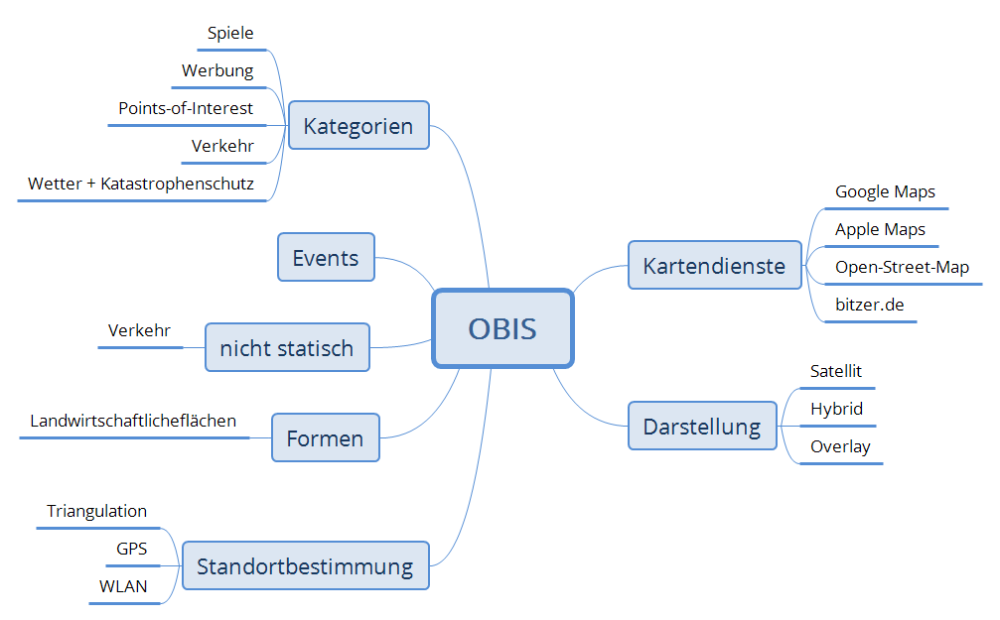

**Mindmap: Ideensammlung Studenten**

--------------------------------------------------------------------------------

## Kartendienste

### GoogleMaps

**Roadmap**

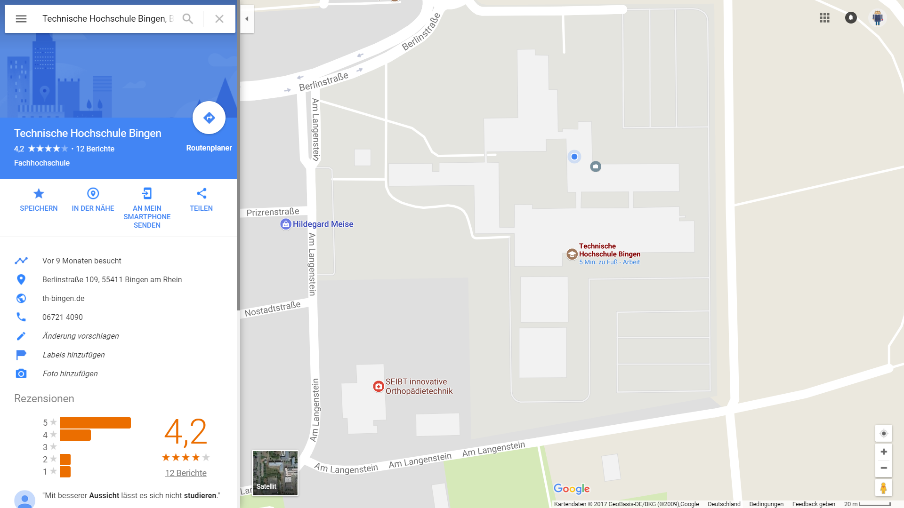

**Satellit**

Dienst:

- Kartendarstellung
- Abbildung: Ortsname/Adresse <=> location
- Anzeige von Points of Interest (POI)
- Navigation (Auto, Fahrrad, zu Fuß, Öffis)

### Zillow

**Häuserkauf bei Zillow**

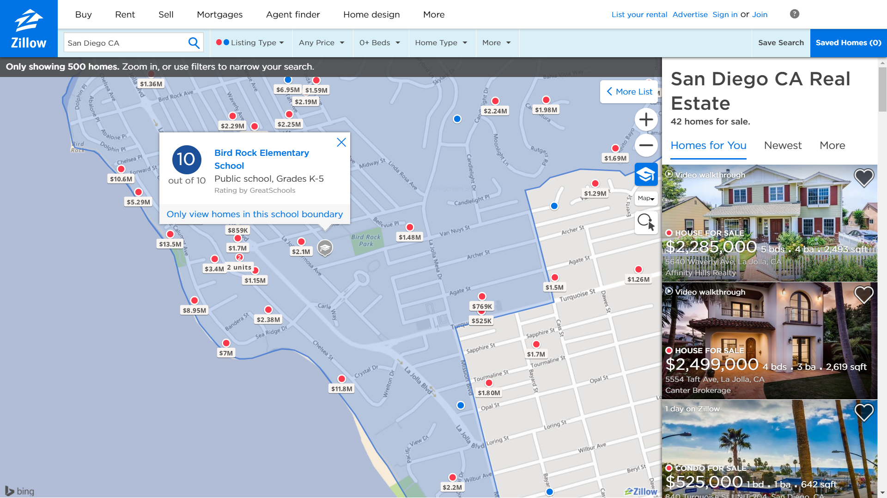

**Zestimate**

Dienst:

- Kartendarstellung
- Daten aus zentraler Maklerdatenbank (Angebote)
- Daten aus anderen öffentlichen Quellen (z.B. Bewertung der Schulen)
- Zillow berechnet aus den öffentlichen Quellen eine Schätzung (Estimate) namens „Zestimate"

### Clever-Tanken

**Clever Tanken App**

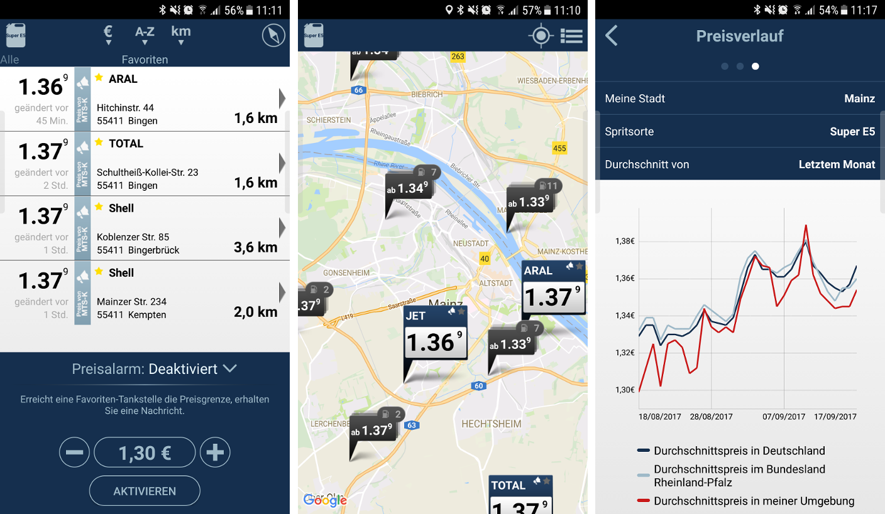

Dienst:

- Kartendarstellung
- Daten aus öffentlichen Quellen darstellen
- Anreichern der Daten mit Zusatzinformationen + Historie

### Mateka'te

[**Mateka'te CCC-MZ-Wi**](https://www.cccmz.de/projekte/matekarte/)

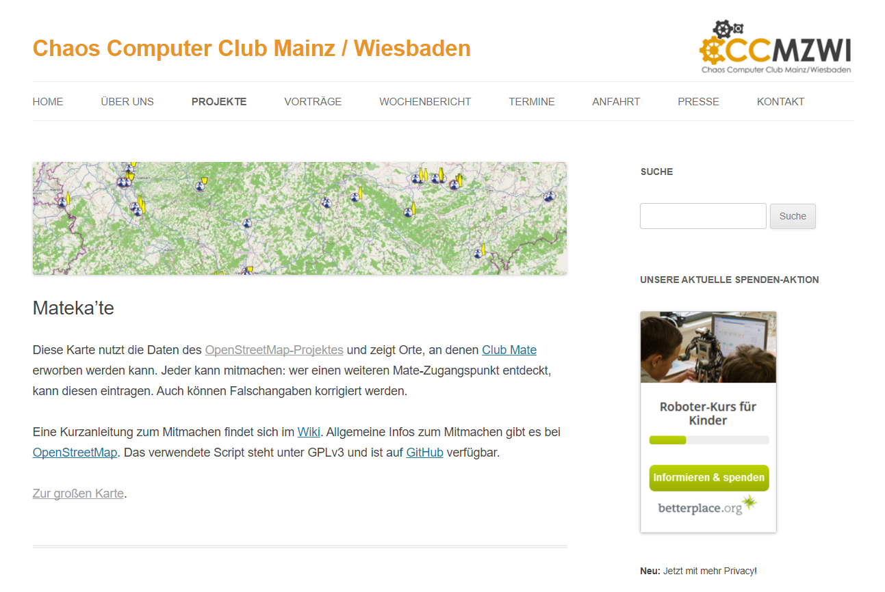

Dienst:

- Kartendarstellung
- crowdsourcing

### what3words

> what3words is a really simple way to talk about location. We have divided the world into a grid of 3m x 3m squares and assigned each one a unique 3 word address. It means anyone can accurately find any location and share it more quickly, easily and with less ambiguity than any other system.

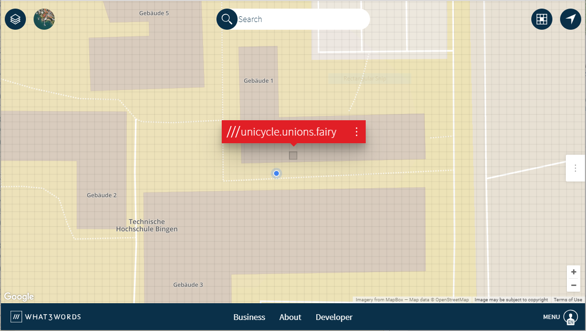

[///unicycle.unions.fairy](https://map.what3words.com/unicycle.unions.fairy)

[///berührte.geiger.pfahl](https://map.what3words.com/ber%C3%BChrte.geiger.pfahl)

Dienst:

- Kartendarstellung

--------------------------------------------------------------------------------

## Definition

- "Ortsbezogene Informationssysteme"
- Raumbezogene Informationssysteme (RIS)

  - engl. spatial information system

- Geo-Informationssysteme (GIS)

  - engl. geographic information system

> A geographic information system (GIS) is a system designed to capture, store, manipulate, analyze, manage, and present spatial or geographic data. [...]

> In general, the term describes any information system that integrates, stores, edits, analyzes, shares, and displays geographic information. GIS applications are tools that allow users to create interactive queries (user-created searches), analyze spatial information, edit data in maps, and present the results of all these operations.

[Wikipedia EN "Geographic information system"](https://en.wikipedia.org/w/index.php?title=Geographic_information_system&oldid=800775304 "Wikipedia EN GIS")

> Geoinformationssysteme, Geographische Informationssysteme (GIS) oder Räumliche Informationssysteme (RIS) sind Informationssysteme zur Erfassung, Bearbeitung, Organisation, Analyse und Präsentation räumlicher Daten. Geoinformationssysteme umfassen die dazu benötigte Hardware, Software, Daten und Anwendungen.

[Wikipedia DE "Geoinformationssystem"](https://de.wikipedia.org/w/index.php?title=Geoinformationssystem&oldid=168115672 "Wikipedia DE GIS")

> A geographic information system (GIS) lets us visualize, question, analyze, and interpret data to understand relationships, patterns, and trends.

> GIS benefits organizations of all sizes and in almost every industry. There is a growing interest in and awareness of the economic and strategic value of GIS.

[ESRI "What is GIS?"](http://www.esri.com/what-is-gis "ESRI What is GIS?")

> Ein Geo-Informationssystem (GIS) ist ein rechnergestütztes System, das aus Hardware, Software und Daten besteht und mit dem sich raumbezogene Problemstellungen in unterschiedlichsten Anwendungsgebieten modellieren und bearbeiten lassen. Die dafür benötigten raumbezogenen Daten / Informationen können digital erfasst und redigiert, verwaltet und reorganisiert, analysiert sowie alphanumerisch und graphisch präsentiert werden. GIS bezeichnet sowohl eine Technologie, Produkte als auch Vorhaben zur Bereitstellung und Behandlung von Geoinformationen.

Bill, Ralf: _Grundlagen der Geo-Informationssysteme_. Wichmann, 5\. Auflage, S. 8

### Geo

- Jedes Datenelement, das in einem Geo-Informationssystem verwaltet wird, ist auf die Erdoberfläche oder einen Teil der Erdkruste bzw. auch der Erdatmosphäre bezogen.
- Die Bezeichnung _Geo_ ist aus dem altgriechischen entliehen "Grund, Land" und soll das Bezugsobjekt _Erde_ andeuten

#### Horizontale Unterteilung

- Regionale oder
- lokale Teilgebiete,
- oder aber auch die ganze Erdoberfläche

#### Vertikale Unterteilung

- Vom Außenraum der Erde (Meteorologie, Klimatologie),
- über die Oberfläche (häufigster Fall)
- bis hin zum Innenraum (Geologie, Geophysik)

--------------------------------------------------------------------------------

## Historie

- 60er Jahre erste Prototyp-Entwicklungen. 1962 wurde das erste moderne GIS in Ottawa durch das Department of Forestry and Rural Development entwickelt. **Dr. Roger Tomlinson** entwickelte ein GIS namens „Canada Geographic Information System" (CGIS). [[W][wikimod]]
- 80er Jahre entstanden heute noch wichtige kommerzielle Produzenten von Geoinformationssystemen.
- Ende des zwanzigsten Jahrhunderts entwickelte sich die GIS-Technologie in Richtung Internet. Dazu war es notwendig, Datenformate und -transfer zu standardisieren. [[W][wikimod]]

  - Erst stationär dann auch mobil

- 2004 [OpenStreetMap](https://www.openstreetmap.org/)

- 2005 GoogleMaps

- 2008 iPhone 3G :iphone: !!!

--------------------------------------------------------------------------------

## Anwendungsbeispiele

### Liegenschaftskarte/Kataster

**[GeoPortal RLP](http://www.geoportal.rlp.de/ "GeoPortal RLP")**

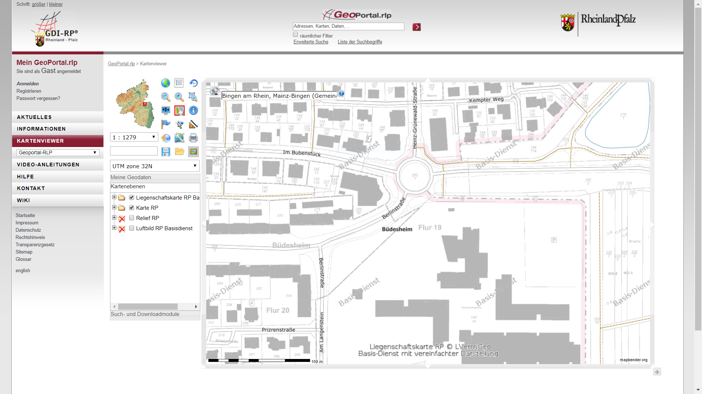

- Wem gehört was?
- Wo _soll_ gebaut werden?
- Wo _kann_ gebaut werden?
- Wie ist die Entwicklung?
- Was wird gebraucht?

### Energieversorger und "Öffentliche Infrastruktur"

- Elektrizität/Strom
- Ferngas/Flüssiggas
- Fern- und Nahwärme
- _Internet_-, Telefon-, Fernsehkabel
- Wasser

  - Trinkwasser
  - Abwasser (Grauwasser, Schwarzwasser, _Niederschlag_)

- _Abfall_

- etc.

Trivia: [Podcast 99%invisible - Making up ground / Archaeosphere][99inv]

### Tourismus

**[Airbnb](https://www.airbnb.com/ "Airbnb")**

**[Booking.com](https://www.booking.com "booking.com")**

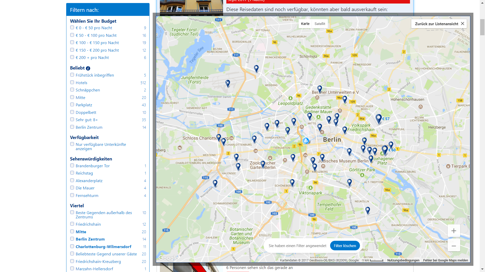

**[Trip Advisor](https://www.tripadvisor.com/)**

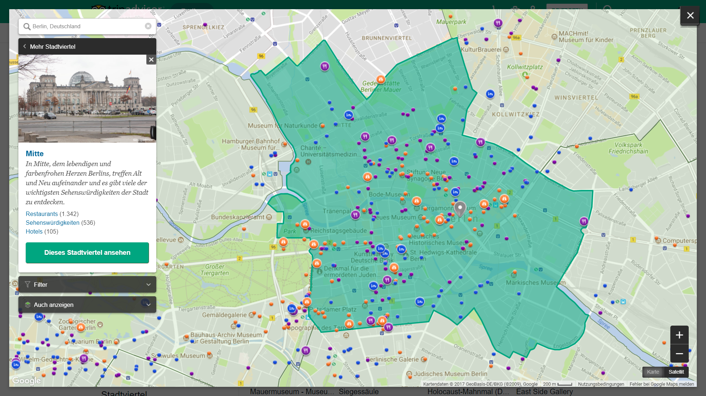

- Wie lange dauert die Fahrt? -> GoogleMaps
- Wo kann ich Übernachten?
- Was kann ich dort erleben?
- Öffis am Reiseziel? -> GoogleMaps
- etc.

### Militärische Anwendungen

[**MQ-1 Predator Drone**](https://commons.wikimedia.org/wiki/File:MQ-1_Lethal_Presence.jpg)

- Truppenkoordination
- Lenkwaffen
- Dronen
- Simulationssysteme
- CLASSIFIED :no_good:

### Bauingenieurwesen

- Sehr viele und vielfältige Anwendungsmöglichkeiten
- Beispiel

  - Terassenplanung (dabei beachten: Höhenprofil, Geologie, Flora, Fauna)
  - Prüfung der Umweltverträglichkeit
  - Stadtplanung
  - [Hochwasserschutz](http://www.hochwassermanagement.rlp.de/servlet/is/8720/)

**GIS vs. CAD**

- CAD: Rechner => Reale Welt
- GIS: Reale Welt => Rechner

### Umweltschutz

**roadkill.at** 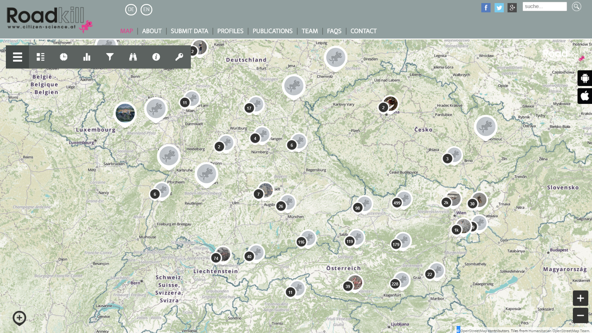

Dienst:

- Kartendarstellung
- Sammeln von Informationen über Wildunfälle über crowdsourcing
- Erforschung von Ursachen

> About Project Roadkill

> In Project Roadkill you can participate in a scientific project with the aim to reduce roadkill. In this project we investigate, which animals are killed on roads and which factors are influencing roadkills. Your data allows us to identify roadkill hotspots. Our vision is to mitigate those hotspots in cooperation with local authorities.

> What does roadkill mean?

> Roadkills are all animals killed on roads. In most countries, official data on roadkills are only available for huntable wildlife. [...] However, there are no data available on the effects of roads on non-huntable wildlife or red list species such as European hedgehog (Erinaceus europaeus) or European green toad (Bufo viridis).

[roadkill.at](http://roadkill.at/en/home-en "roadkill.at")

**Frage: Wie geht man mit crowdsourcing Daten um?**

### Exkurs: Crowdsourcing

[The Guardian: Google Maps Android robot urinating on Apple](https://www.theguardian.com/technology/2015/apr/24/google-maps-hides-an-image-of-the-android-robot-pissing-on-apple) 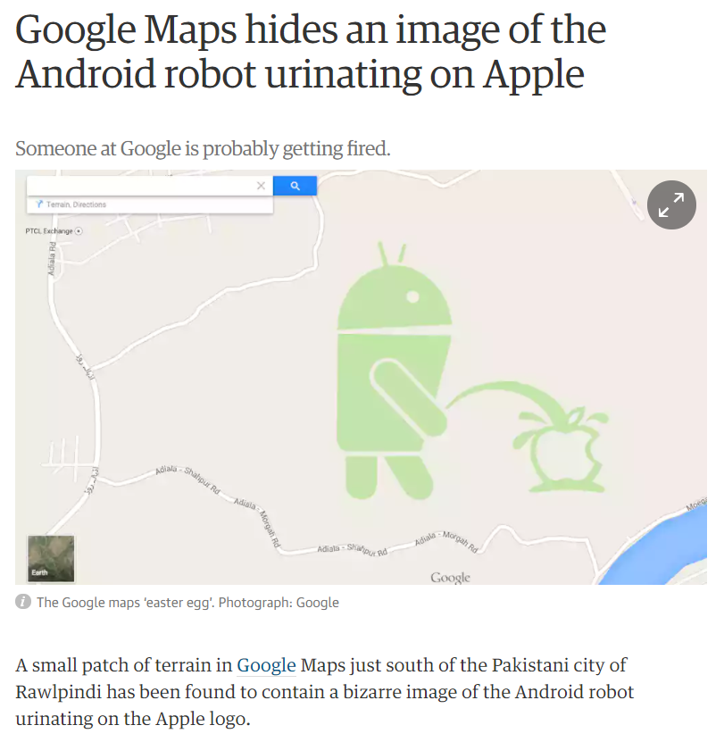

[The Guardian: Google Maps Review Policy is Crap](https://www.theguardian.com/technology/2015/apr/24/google-maps-hides-an-image-of-the-android-robot-pissing-on-apple) 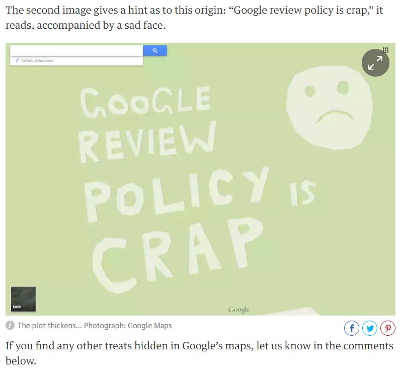

- Pech gehabt?
- Kann man was dagegen machen?
- OpenStreetMap?
- Roadkill App?
- Soll man es lieber ganz lassen?

### Weitere Anwendungsbereiche

- Koordination von Einsatzfahrzeugen
- Katastrophengebiete

  - Dronen
  - Keine Straßen
  - Satellitenbild
  - etc.

- Land- und Forstwirtschaft

- Logistik

- Meteorologie

### Vorteile

- Langzeitspeicherung

  - _keine_ Alterseffekte (Stein, Papier)
  - kleiner Raumbedarf (Planschränke)

- Schnellere Fortführung von Daten

- _einfache_ Transformation von Daten / Verknüpfung von Datenquellen

- Beliebige Kombination von verschiedenen Themen

- Flexible, vielfältige Auswerte- und Analysemöglichkeiten

- Einfachere Erweiterungsmöglichkeiten

  - Daten
  - Funktionen

**Zusammenfassend:**

- GIS ist **kein** Zeichentool

  - (eher: man kann letztendlich sehr flexibel Zeichnungen oder Grafiken damit generieren)

- Mit Hilfe von Geoinformation und Geoinformationssystemen werden Fragestellungen beantwortet

- Sehr starke Verbreitung in vielen Fachgebieten/Anwendungsbereichen

- Google, Microsoft und viele andere Firmen investieren Milliardenbeträge

## Interessante Links

- [The Best Map of a City: The Nolli Map of Rome][nolli]

[][nolli]

- [Space: The Next Trillion Dollar Industry][spaceinc]

[][spaceinc]

[99inv]: http://99percentinvisible.org/episode/making-up-ground/
[nolli]: https://youtu.be/EeJZR3Pv9tM
[spaceinc]: https://youtu.be/hiRBQxHrxNw
[wikimod]: https://de.wikipedia.org/w/index.php?title=Geoinformationssystem&oldid=168115672#Entwicklung_moderner_GIS
