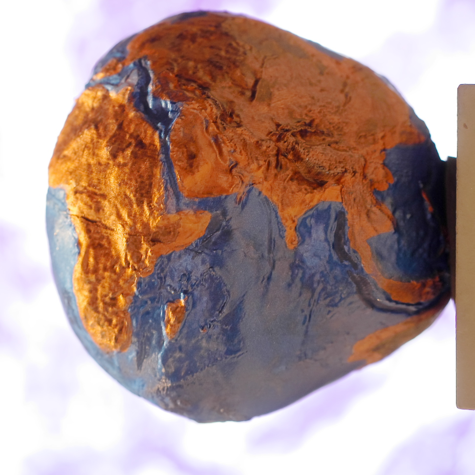
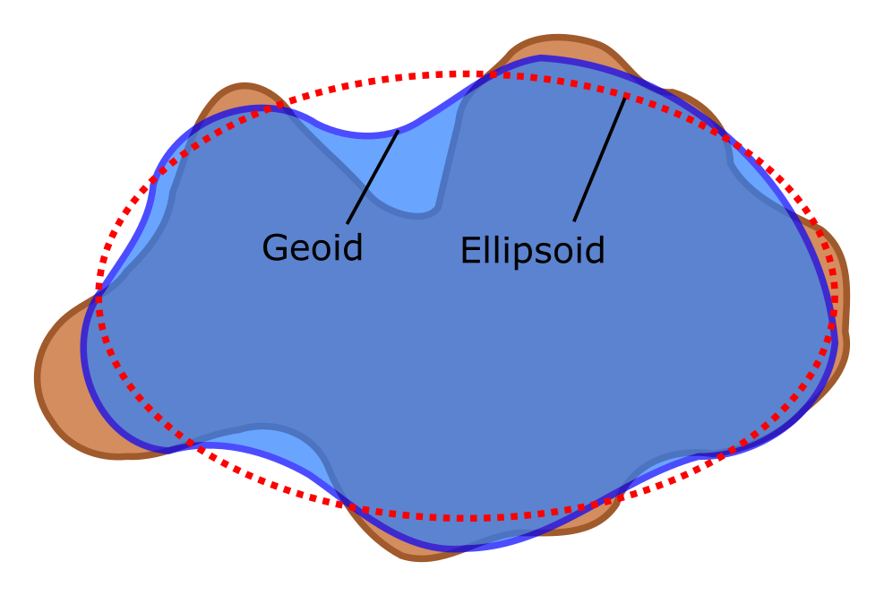

# Geodäsie

> Die Geodäsie ist [...] die Wissenschaft von der Ausmessung und Abbildung der Erdoberfläche. Dies umfasst die Bestimmung der geometrischen Figur der Erde, ihres Schwerefeldes und der Orientierung der Erde im Weltraum.

[Wikipedia: Geodäsie](https://de.wikipedia.org/w/index.php?title=Geod%C3%A4sie&oldid=168807274 "Geodäsie")

Dreidimensionales Modell der "Potsdamer Kartoffel" (2017) mit einer 15000-fach überhöhten Darstellung des Geoids

## Probleme

- Keine "perfekte" Erdkugel
- Abplattung an den Polen um etwa 0,3 Prozent (> 21 km)
- Kugel ist nur brauchbar, wenn **keine** Genauigkeit von besser als 10 km erforderlich ist
- selbst ein Schulatlas braucht 10-mal besseres Modell

## Erdfigur

> Als Erdfigur (oder auch Erdgestalt) wird eine mathematisch möglichst einfach definierbare Annäherung an die Form der Erde bezeichnet.

[Wikipedia: Erdfigur](https://de.wikipedia.org/w/index.php?title=Erdfigur&oldid=169268183 "Erdfigur")

### Geoid

- Modell der Erde
- Wie ist das Gravitationsfeld der Erde?
- Beeinflusst durch Dichteunterschiede der Erde
- Vorstellungshilfe: Wie würde ein globaler Ozean jeden Punkt der Erde bedecken? (Meeresspiegel)
- Trotz allem zu komplex für Berechnungen

### Ellipsoid

- Mathematisches Modelle der Erde
- Einfachere Berechnungen
- Verschiedene angepasste Ellipsoide für Regionen
- unterscheiden sich um bis zu 1000 Meter, deshalb bei genauen Ortsangaben immer das Bezugssystem mit angeben

YouTube Video von [minutephysics](https://www.youtube.com/user/minutephysics/) mit dem Titel "[What is Sea Level?](https://youtu.be/q65O3qA0-n4)"

**Weitere Videos**

- [GOCE: Geoid](https://youtu.be/qu-o75pe5GY)
- [Coordinate System Jargon: geoid, datum, projection](https://youtu.be/Z41Dt7_R180)
