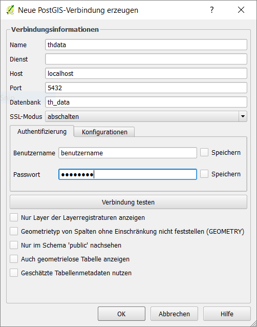

# Aufgabe 1

Installiert folgende Tools:

- [QGIS](https://qgis.org/de/site/) (Proj + cs2cs)
- PostgreSQL + PostGIS

  - [Docker](https://hub.docker.com/r/mdillon/postgis/) (Empfehlung)
  - `docker run --name obis1819 -p 5432:5432 -e POSTGRES_PASSWORD=postgis -d mdillon/postgis`
  - Native

- Macht euch einen [Studenten Account](https://www.jetbrains.com/buy/classroom/) bei JetBrains und installiert via der [JetBrains ToolBox](https://www.jetbrains.com/toolbox/app/)

  - [DataGrip](https://www.jetbrains.com/datagrip/)
  - [IntelliJ IDEA Ultimate](https://www.jetbrains.com/idea/) (wird erst später benötigt)

# Aufgabe 2

- Welche Version von PostgreSQL habt ihr installiert? (Hinweis: Hier hilft ein `SELECT` Statement)
- Erstellt eine PostGIS Datenbank und importiert die Daten in den beiden `*.sql` Files.
- Wie viele Datensätze sind in jeder Tabelle?
- Wie sind die Tabellen aufgebaut?

# Aufgabe 3

- Öffnet QGIS und installiert die Erweiterung `OpenLayers Plugin`. Unter `Web` erscheint dann ein neuer Eintrag.
- Überlegt euch ein oder zweit berühmte Orte und sucht diese in QGIS mit dem Plugin heraus.
- Macht Screenshots von diesem Ort mit verschiedenen Kartendarstellungen

# Aufgabe 4

- Fügt einen neuen `WMS Layer` hinzu.
- Nehmt dafür folgende URL: <http://www.geoportal.rlp.de:80/mapbender/php/wms.php?inspire=1&layer_id=30694>
- Nach dem Klick auf Verbinden wählt `rp_dop` aus und fügt diesen Layer hinzu.
- Was seht ihr, wenn ihr mit rechtsklick Kontextmenü auf den vollen Layer zoomt?

# Aufgabe 5

Fügt mit den Daten aus Aufgabe 2 einen `PostGIS` Layer für die Studenten, als auch die Gebäude hinzu.

