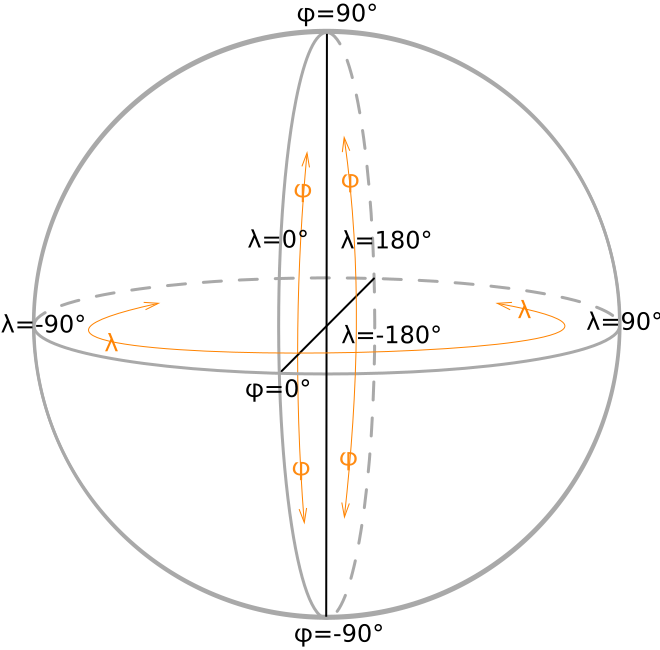
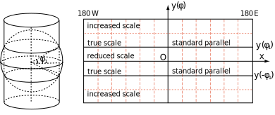
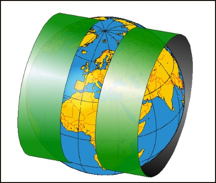
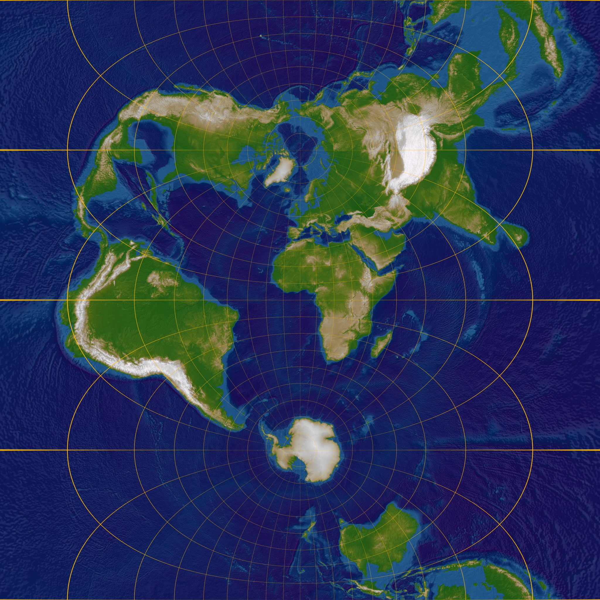
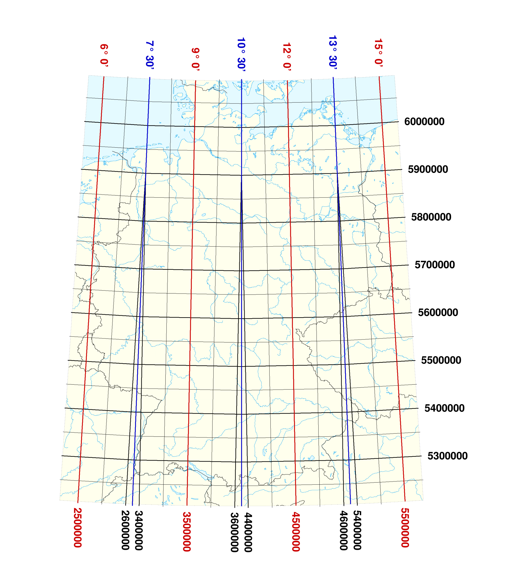
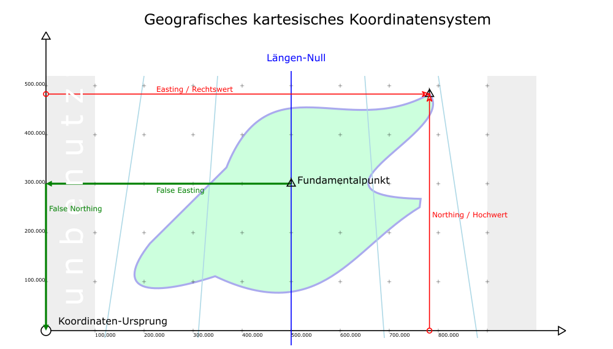
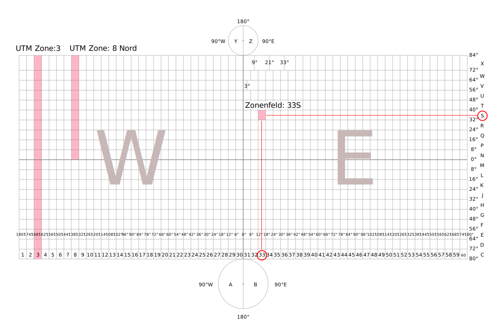
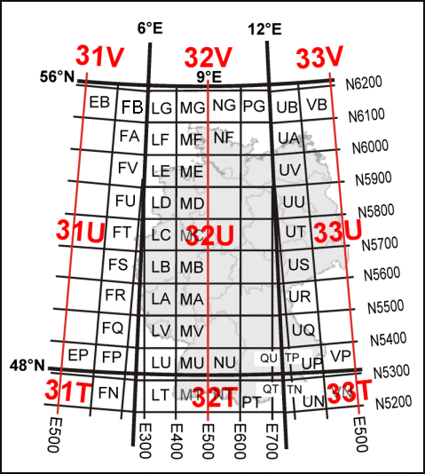

# Geographische Koordinaten

- Angabe in Grad am besten mit Himmelsrichtung (N 49.952215°, E 7.925345°)
- Längengrad

  - Latitude
  - `-90°` (Südpol) - `90°` (Nordpol)
  - Äquator `0°`

- Breitengrad

  - Longitude
  - `-180°` (Westen) - `180°` (Osten)
  - [Nullmeridian][nm] verläuft durch die [Londoner Sternwarte Greenwich][lsg]

- Datum: WGS84 (World Geodetic System)

  - wird als Standard für Satellitensysteme verwendet
  - EPSG: [4326][llwgs84]

- [LatLong.net][latlong]

  - Adresse <=> Lat Long
  - Lat Long <=> degrees, minutes, seconds (DMS)
  - Lat Long => UTM

- Es fehlt noch die Höhe, um die Position im dreidimensionalen Raum zu bestimmen

# Das Runde muss ins Eckige

- Die Erdkugel auf einem _flachen_ Blatt Papier darzustellen ist schwierig (siehe [02-kartografie][02kat])
- Projektion von einem [räumlichen Polarkoordinatensystem][rpks] in ein [zweidimensionales kartesisches Koordinatensystem][zdkks]

**Zylinder in der Normalen**

**Zylinder in der transversalen Lage** (Streifenbreite überhöht)

- Streifen aus einem Zylinder in transversalen Lage
- Einschnürung, um die Verzerrung über eine größere Fläche gering zu halten

**Transversale Mercator-Projektion für den Nullmeridian**

# Gauß-Krüger-Koordinatensystem

- Transversale Projektion
- 3° breite Meridianstreifen
- Von Nord- nach Südpol
- In der Mitte eines jeden Streifen liegt ein "Mittelmeridian" (0°, 3°, 6°, ...)
- Jeder Streifen hat eine Kennzahl

  - Kennziffer = {0°, 3°, 6°, ..., 351°, 354°, 357°} / 3°

- Der Zylindermantel berührt auf dem Mittelmeridian den Referenzellipsoid (keine Einschneidung)

  - Auf dem Mittelmeridian gibt es keine Verzerrung
  - Die Verzerrung nimmt zu den Rändern zu

- In Deutschland kommt als Referenzellipsoid meist der Bessel-Ellipsoid zum Einsatz
- EPSG für Kennziffer 2: [31466][gkz2]
- EPSG für Kennziffer 3: [31467][gkz3]
- EPSG für Kennziffer 4: [31468][gkz4]
- EPSG für Kennziffer 5: [31469][gkz5]

Die roten Linien markieren die Mittelmeridiane, die blauen Linien die Meridianstreifenränder.

Koordinatenursprung für die Meridianstreifen ist der Schnittpunkt von [Äquator][aeq] und Mittelmeridian

- Rechtswert (y)
- Hochwert (x)
- Werte werden in Meter angegeben
- Um negative Werte bei den Rechtswerten zu vermeiden, wird ein konstanter Wert von 500.000 m addiert
- Was ist mit dem Hochwert?

Dem Rechtswert wird die Kennziffer bei der Angabe von Koordinaten voran geschrieben.

`Rechtswert 3461404 m, Hochwert 5483498 m`

- Die erste Ziffer beim Rechtswert (3) sagt uns, dass wir Kennziffer 3 haben, also der Mittelmeridian bei 9° Ost liegt.
- Da die 461.404 kleiner als 500.000 ist, ist ersichtlich, dass die Position westlich vom Mittelmeridian liegt. (siehe oben)

Gauß-Krüger angaben für die TH:

- `2638192 5536922`
- `3422970 5535653`
- `4207702 5543099`
- `4992597 5559130` !! Kennziffer 5 !!

[Geoportal RLP](http://www.geoportal.rlp.de)

# UTM

- Transversale Projektion
- Projektionszylinder schneidet die Oberfläche

  - => Verkürzter Mittelmeridian
  - Faktor: 0,9996
  - Abstand zwischen den Durchdringungskreisen ist 360 km (3° am Äquator)

- 6° Breite "Zonen" (Streifen)
- Nord- und Südpol werden mit der [Universale Polare Stereografische Projektion][upsp] abgebildet
- EPSG für Zone 32 mit [ETRS89]: [25832][utm32etrs]
- EPSG für Zone 32 mit WGS84: [32632][utm32wgs]

- Easting
- Northing
- Werte werden in Meter angegeben
- Um negative Werte bei den Easting-Werten zu vermeiden, wird ein konstanter Wert von 500.000 m addiert
- Auf der Südhalbkugel wird per Definition der Äquator auf den Wert 10.000.000 m gesetzt, um positive Werte für Northing zu erhalten

## Koordinatenbeispiel

System                    | Angabe (alles WGS84)
------------------------- | ------------------------------
Geographische Koordinaten | 49° 29' 13,6" N 8° 27' 58,6" E
UTM-Koordinaten           | 32 N 461344 5481745
[MGRS] 1m Genauigkeit     | 32U MV 61344 81745
[MGRS] 10km Genauigkeit   | 32U MV 6 8

Das [Military Grid Reference System][mgrs] teilt die _Zonen_ (z.B. 32U) nochmal in Quadrate der Größe 100km x 100km

## Unterschiede

UTM                     | Gauß-Krüger
----------------------- | ----------------------------------
Transversale Projektion | Transversale Projektion
schneidet               | liegt auf
6°-Streifen             | 3°-Streifen
Easting/Northing        | Rechtswert/Hochwert
Meter                   | Meter
---                     | wird immer mehr durch UTM abgelöst

# Projektion vs Ellipsoid

**Achtung**: Projektion und Ellipsoid sind nicht das gleiche!

Projektion                | Datum    | Ellipsoid             | EPSG
------------------------- | -------- | --------------------- | ------------------
Geographische Koordinaten | ---      | [WGS84]               | [4326][llwgs84]
Gauß-Krüger Zone 2        | [DHDN]   | [Bessel 1841][bessel] | [31466][gkz2]
Gauß-Krüger Zone 3        | [DHDN]   | [Bessel 1841][bessel] | [31467][gkz3]
Gauß-Krüger Zone 4        | [DHDN]   | [Bessel 1841][bessel] | [31468][gkz4]
Gauß-Krüger Zone 5        | [DHDN]   | [Bessel 1841][bessel] | [31469][gkz5]
UTM Zone 32               | [WGS84]  | [WGS84]               | [32632][utm32wgs]
UTM Zone 32               | [ETRS89] | [GRS80]               | [25832][utm32etrs]

[02kat]: ../02-kartografie/README.md "Vorlesung Kartografie"
[aeq]: https://de.wikipedia.org/wiki/%C3%84quator
[bessel]: https://de.wikipedia.org/wiki/Bessel-Ellipsoid "Bessel-Ellipsoid"
[dhdn]: https://de.wikipedia.org/wiki/Deutsches_Hauptdreiecksnetz "Deutsches Hauptdreiecksnetz"
[etrs89]: https://de.wikipedia.org/wiki/Europ%C3%A4isches_Terrestrisches_Referenzsystem_1989 "Europäisches Terrestrisches Referenzsystem 1989"
[gkz2]: http://spatialreference.org/ref/epsg/31466/
[gkz3]: http://spatialreference.org/ref/epsg/31467/
[gkz4]: http://spatialreference.org/ref/epsg/31468/
[gkz5]: http://spatialreference.org/ref/epsg/31469/
[grs80]: https://de.wikipedia.org/wiki/Geod%C3%A4tisches_Referenzsystem_1980 "Geodätisches Referenzsystem 1980"
[latlong]: https://www.latlong.net/ "LatLong.net"
[llwgs84]: http://spatialreference.org/ref/epsg/4326/
[lsg]: https://de.wikipedia.org/wiki/Royal_Greenwich_Observatory
[mgrs]: https://de.wikipedia.org/wiki/UTM-Referenzsystem "Military Grid Reference System"
[nm]: https://de.wikipedia.org/wiki/Nullmeridian "Nullmeridian"
[rpks]: https://de.wikipedia.org/wiki/Kugelkoordinaten
[upsp]: https://de.wikipedia.org/wiki/Universale_Polare_Stereografische_Projektion
[utm32etrs]: http://spatialreference.org/ref/epsg/25832/
[utm32wgs]: http://spatialreference.org/ref/epsg/32632/
[wgs84]: https://de.wikipedia.org/wiki/World_Geodetic_System_1984 "World Geodetic System 1984"
[zdkks]: https://de.wikipedia.org/wiki/Kartesisches_Koordinatensystem_(Geod%C3%A4sie)
