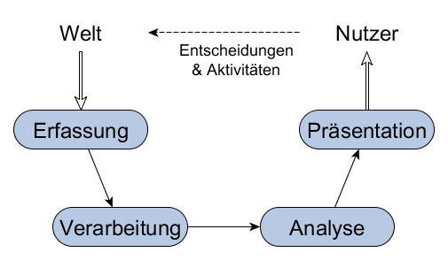
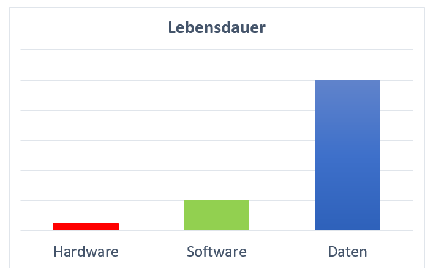
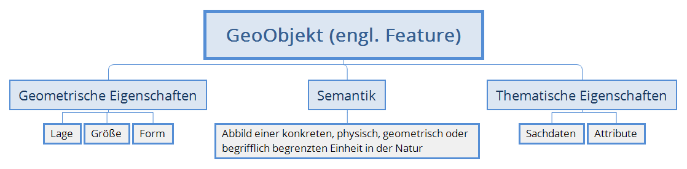
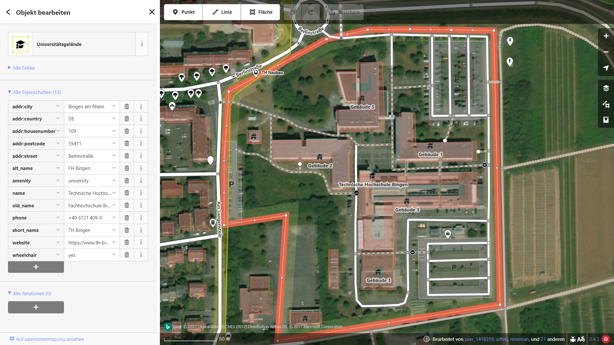
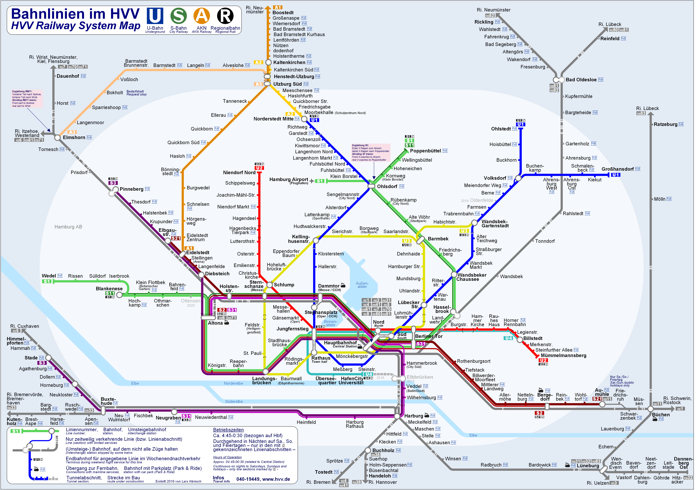
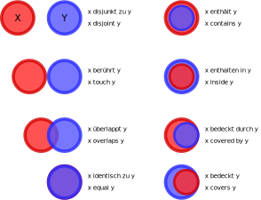

# Informationssysteme (IS)

- Ein Informationssystem besteht aus:
  - Daten
  - Verarbeitungswerkzeugen
- Die Daten liegen idealerweise strukturiert vor z.B. in einer Datenbank
  - Unterschiedliche Aspekte der Welt/Daten sind getrennt abgelegt
  - Relevante Daten können in unterschiedlichen Layer visualisiert werden
- Verarbeitungswerkzeuge sind Methoden (Softwarekomponenten) zur Verarbeitung/Analyse der Daten
- Informationssysteme sind kein geschlossenes statisches System
  - Kontinuierlicher Datenfluss (vom Erfassen bis zur Ausgabe)
  - System ist offen gegenüber Entwicklungen, Veränderungen

Beispiel: [Wo sind in Deutschland besonders viele Einwohner von Erdbeben betroffen?][erdbeben]

[erdbeben]: http://www.geoportal.de/DE/Geoportal/Karten/karten.html?lang=de&wmcid=59 "GeoPortal DE"

## EVAP

**E**rfassen -- **V**erarbeitung -- **A**nalyse -- **P**räsentation

Vierkomponentenmodell nach H. Chalkins 1977

- **Erfassung**: Erfassung von Daten, aber auch Erfassung von Veränderungen, die oft mit Reorganisation der Daten verbunden sind.
- **Verarbeitung/Verwaltung**: Umfasst Modellierung, Strukturierung, Speicherung und Reorganisation der Daten
- **Analyse**: Beinhaltet vielfältige Methoden zur Analyse der Daten, z.B. Weg Findung/Navigation
- **Präsentation**: Darstellung/Visualisierung der Daten in kartographischer oder kartenähnlicher Form z.B. im Web

## Komponenten

- Hardware (heute: Standard-Hardware, früher oft Spezial-Hardware)
- Software (DBMS, Analysetools)
- Strukturierte Daten
  - Raumbezogene Daten
  - Allgemeine Daten
- Standard Methoden zur Verarbeitung der Daten
- Schnittstellen zur Anbindung an interne/externe Datenquellen

## Lebensdauer

## Arten von GIS

- Desktop-GIS (single user)
- Client-Server-GIS (Datenserver / Funktionsserver)
- Geo Webservices: Spezifische Geo-Dienste, die über das Internet bereitgestellt werden (heute oft standardisiert)
- Location based Service: Geo Webservices, welche die Position des (mobilen) Nutzers berücksichtigen (=> Smartphone)
- WebGIS: GIS-Applikationen, deren Kernfunktionen auf Geo Webservices zurückgreifen und komplett im Browser laufen
- Digitale Globen

---

# Raumbezogenes Objekt

Der TH-Campus hat eine Geometrie, also ein Polygon aus mehreren Punkten, die das Gelände der TH markieren. Zusätzlich sind diesem Polygon Sachdaten zugeordnet z.B. Telefonnummer, Rollstuhltauglichkeit.

- Semantik: TH Bingen
- Geometrie: Polygon
- Informationen: Sachdaten/Attribute

## Direkter vs Indirekter Raumbezug

- Objekte mit direktem Raumbezug sind Geometrien mit Geo-Koordinaten. Hierzu gehören z.B. die Position einer Sehenswürdigkeit, das Polygon für den Grundbesitz oder der Linienzug einer Autobahn.
- Objekte mit indirektem Raumbezug haben Attribute zugeordnet, mit denen man Aussagen über die Position machen kann. Diese Angaben, sind aber keine Geo-Koordinaten Beispiele hierfür sind die PLZ, Gemeindekennzahlen, Adressen oder ein [Grid/Rasterzellen][raster].

[raster]: https://de.wikipedia.org/wiki/Rasterdaten

## Thematische Eigenschaften

Sachdaten kann man grob in diese Vier Kategorien unterteilen:

- **Nominaldaten**: beschreiben Eigenschaften, die rein qualitativ sind. Bsp.: Landnutzungsklassen, Verwaltungsbezirke. Keine quantitativen Aussagen.
- **Ordinaldaten**: sind nach einem Kriterium sortiert. Bsp.: Güteklassen (sehr gut, gut, mittelmäßig, schlecht). Nicht gleichabständig sortiert!
- **Intervalldaten**: sind metrische Daten mit einer gleichabständiger Skala: Additionen und Subtraktionen möglich, z.B. Temperaturen in °C.
- **Rationdaten**: haben einen absoluten Nullpunkt, z.B. Höhendaten, Schadstoff- oder Niederschlagsmessungen.

---

# Layer

- Einer der großen Vorteile eines GIS ist die Möglichkeit der Verknüpfung von Informationen unterschiedlicher Thematik
- Unterschiedlichen Themen können Layer zugewiesen werden
- Layer stellen ein allgemeines Organisationsprinzip dar
- Layer sind sogar eine "Speichereinheit" in GIS Systemen
- Um Analysen zu ermöglichen, ist es notwendig Layer einheitlich zu georeferenzieren

> Spatial data layers can be overlaid, manipulated and combined to form composite layers

## Vector vs Raster

Thema                | Vectordaten              | Rasterdaten
---------------------|--------------------------|------------------------------
Repräsentation       | Punkte, Linien, Polygone | Rechteckige Matrix aus Werten
Datenmenge           | gering                   | abhängig von der Auflösung
Berechnungen         | einfach                  | minimalst
Erfassungsaufwand    | hoch                     | gering
Analysemöglichkeiten | vielfältig               | vielfältig
Objektstrukturierung | einfach                  | schwierig

Bei Rasterdaten ist die Informationen über die Pixeltiefe gespeichert

- Pixeltiefe
  - 1 Bit (2 Stufen, binär)
  - 8 Bit (265 Stufen)
  - ...
- Werte des Pixels können Grauwerte repräsentieren, jedoch auch beliebige andere Themen (z.B. Höhen, Emissionswerte, Einwohnerdichte) codieren (Schlagwort: [Falschfarbenbild][ffb])
- Pixelauflösung: Ausdehnung des Pixels definiert geometrische Genauigkeit
- Die Pixelposition codiert die Koordinate. Indirekte Orientierung/ Geo-Referenzierung in der Regel über Eckpunkte.

[ffb]: http://www.seos-project.eu/modules/remotesensing/remotesensing-c03-p01.de.html

---

# Topologie

- Bisher: Geometrische Formen
  - Punkte
  - Linienzug
  - Polygone
  - Kreise
- Jetzt: Betrachtung von Graphen

Ein Graph besteht auf Knoten und Kanten. Dabei kann ein Graph auch gerichtet sein. (siehe ALDA Vorlesung)

Warum: Neben der Geometrie (Form, Größe und Lage) der Geo-Objekte müssen auch die topologischen Beziehungen der Objekte betrachtet werden können.

Man könnte die Topologie auch als "Geometrie ohne Koordinaten" bezeichnen

- Repräsentation als Graph ermöglicht Analysen mit Standardalgorithmen
- Topologische Analysen spielen eine wichtige Rolle im GIS:
  - Eine **Liniengraph**, der z.B. für die Navigation verwendet wird, muss exakte *Verbindungen* aufweisen, welche die Nachbarschaftsbeziehungen miteinander verknüpfen, damit ein Routing möglich ist
  - "Huch, wo ist den der Rest von meiner Autobahn hin?"
  - **Graphen** mit vollständiger Topologie repräsentieren Datensätze, die *lückenlos* und *überlappungsfrei* sein müssen, z.B. bei Katasterdaten von Grundstücken
  - "Gibt es benachbarte belastete Grundstücksflächen mit dem Grundstück eines Kinderkartens? Nein, dann ist ja gut."
- => Voraussetzung: Alles ist ordentlich modelliert/verbunden

## Topologie Beziehungen

---

# Metadaten

> Als Metadaten (auch: Metainformationen) werden strukturierte Daten bezeichnet, die Informationen über andere Informationsressourcen enthalten. Sie sind typischerweise maschinenlesbare Informationen über elektronische Ressourcen oder andere Dinge („Daten über Daten“).

**Buch**
- Author
- Titel
- Verlag
- Erscheinungsjahr
- Anzahl der Seiten
- ISBN

## Metadaten bei Geodaten

> In der [INSPIRE-Richtlinie][inspire] sowie in dem darauf aufbauenden Gesetz über den Zugang zu digitalen Geodaten (Geodatenzugangsgesetz - GeoZG) findet sich eine Legaldefinition für Metadaten im Bereich der Geoinformationsverarbeitung: "**Metadaten sind Informationen, die Geodaten oder Geodatendienste beschreiben und es ermöglichen, Geodaten und Geodatendienste zu ermitteln, in Verzeichnisse aufzunehmen und zu nutzen.**" (§ 3 Abs. 2 GeoZG)

[Wikipedia: Metadaten](https://de.wikipedia.org/wiki/Metadaten#Metadaten_bei_Geodaten)

[INSPIRE GeoPortal](http://inspire-geoportal.ec.europa.eu/)

[inspire]: https://de.wikipedia.org/wiki/Infrastructure_for_Spatial_Information_in_the_European_Community "Infrastructure for Spatial Information in the European Community"

---

# Geofencing

> Mit Geofencing (Kunstwort aus geographic [engl. geographisch] und fence [engl. Zaun]) wird das automatisierte Auslösen einer Aktion durch das Überschreiten einer gedachten Begrenzung auf der Erdoberfläche oder in der Luft bezeichnet. In den meisten Fällen definiert die Begrenzung eine geschlossene Fläche, so dass zwischen innen und außen unterschieden werden kann.

- Rechtecke
- Kreise
- beliebige Polygone

> Beispielsweise kann beim Eintritt in die Fläche oder beim Verlassen der Fläche eine Benachrichtigung ausgelöst werden.

[Wikipedia: Geofencing](https://de.wikipedia.org/wiki/Geofencing)

**Anwendungen**:
- Werbung
- Spiele (Ingress, PokemonGO)
- Intelligente ToDo-Liste
- Sicherheit
  - LKW
  - Baumaschinen
  - Kinder
  - ACHTUNG Privatsphäre
