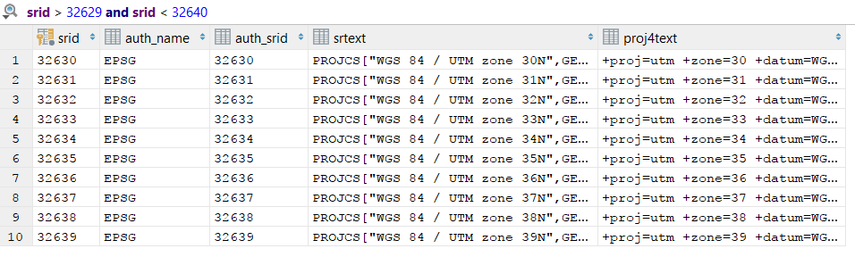
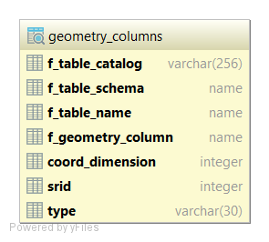

Diese Vorlesung/Übung basiert auf dem [Workshop Material][workshop] von Boundless, welches unter der Creative Commons "Attribution-NonCommercial-ShareAlike" [CC BY-NC-SA 3.0][license] Lizenz veröffentlicht wurde. Das zum Download angebotene Kursmaterial liegt als Kopie auch im aktuellen Ordner dieses README.

--------------------------------------------------------------------------------

# PostGIS

> PostGIS is a spatial database extender for PostgreSQL object-relational database. It adds support for geographic objects allowing location queries to be run in SQL.

<http://postgis.net/>

```sql
SELECT superhero.name
FROM city, superhero
WHERE ST_Contains(city.geom, superhero.geom)
AND city.name = 'Gotham';
```

- Liste der Namen von Superheros welche innerhalb der Stadtgrenzen von Gotham sind. (Antwort?)
- ST_Contains: Returns true if and only if no points of B lie in the exterior of A, and at least one point of the interior of B lies in the interior of A.
- `boolean ST_Contains(geometry geomA, geometry geomB);`

PostGIS Features:

- PostGIS **speichert** Informationen über Position und Projektion und bietet Möglichkeiten diese einfach abzufragen (**queries**)
- Bietet **Geographische Objekte** (geometry, geography, raster, ...) für die PostgreSQL Datenbank
- Bietet **Funktionen**, **Operatoren** und **Indexierungshilfen** für diese Geographischen Objekte (siehe [PostGIS Reference][pgref])
- Bietet Funktionen für übliche und fortgeschrittene Operatoren z.B. "creation, conversion, reprojection, buffer, convex hull, generalization, union, ..."
- Importierung von Vectordaten:

  - [shapefile][shfil]
  - [KML][kmlfil] (Google Earth)
  - [GML][gmlfil]
  - [GeoJSON][gjson]
  - [WKT][wktfil]

- Importierung von Rasterdaten:

  - [GeoTIFF][gtiffil]
  - PNG
  - JPG

- Globale Vermessungen

- Funktionen, Objekte und Indexe in 3D
- OpenSource (GPL)
- Ist eine gute Datenquelle für den "GeoServer", der Dienste wie WMS, WFS, WCS und WPS zur Verfügung stellt

## Web Service Standards

Vom Open Geospatial Consortium (OGC) definierte Standards, um Web Clients die Möglichkeit zum Abfragen von Geographischen Daten zu ermöglichen.

- WMS = Web Mapping Service
- WFS = Web Feature Service
- WCS = Web Coverage Service
- WPS = Web Processing Service

# Geo-Daten in PostGIS

```sql
CREATE TABLE geometries (name varchar, geom geometry);
```

Erzeugt eine Tabelle mit geometry Spalte

```sql
INSERT INTO geometries VALUES
  ('Point', 'POINT(0 0)'),
  ('Linestring', 'LINESTRING(0 0, 1 1, 2 1, 2 2)'),
  ('Polygon', 'POLYGON((0 0, 1 0, 1 1, 0 1, 0 0))'),
  ('PolygonWithHole', 'POLYGON((0 0, 10 0, 10 10, 0 10, 0 0), (1 1, 1 2, 2 2, 2 1, 1 1))'),
  ('Collection', 'GEOMETRYCOLLECTION(POINT(2 0), POLYGON((0 0, 1 0, 1 1, 0 1, 0 0)))');
```

Fügt der Tabelle einen Point, Linestring, Polygon, Polygon mit Loch und eine Collection von Geometrien hinzu.

```sql
CREATE TABLE other_table (point geometry(POINT, 32632));
```

Begrenzung des Type und Definition des Geographischen Referenz Systems

```sql
SELECT name, ST_AsText(geom) FROM geometries;
```

Auf diese Tabelle können natürlich auch queries ausgeführt werden

name            | st_astext
--------------- | -------------------------------------------------------------
Point           | POINT(0 0)
Linestring      | LINESTRING(0 0,1 1,2 1,2 2)
Polygon         | POLYGON((0 0,1 0,1 1,0 1,0 0))
PolygonWithHole | POLYGON((0 0,10 0,10 10,0 10,0 0),(1 1,1 2,2 2,2 1,1 1))
Collection      | GEOMETRYCOLLECTION(POINT(2 0),POLYGON((0 0,1 0,1 1,0 1,0 0)))

## Metadaten Tabellen

- `spatial_ref_sys`: definiert alle der Datenbank bekannten spatial reference systems.
- `geometry_columns` (eigentlich view): ist eine Liste aller "features" (Spalten), welche Geo-Daten enthalten.

```sql
select * from spatial_ref_sys;
```



```sql
select * from geometry_columns;
```



- `f_table_catalog`, `f_table_schema` und `f_table_name` zusammen geben den vollen qualifizierten Namen der Tabelle an, die das Feature enthält
- `f_geometry_column` ist der Name der Spalte mit dem Geometrie Feature. Bei mehreren Spalten mit Geometrie Features, gibt es mehrere Records (Zeilen) in `geometry_columns`.
- `coord_dimension` definiert die Dimension der Geometrie (2D, 3D, 4D)
- `srid` definiert das Räumliche Referenz System
- `type` definiert den Geometrie-Typ (GEOMETRY, POINT, ...)

Durch `geometry_columns` können andere GIS-Anwendungen und libraries herausfinden, was zu erwarten ist, wenn Daten aus dem Feature gelesen oder abgefragt werden. Dann können auch nötige Projektionen, Berechnungen oder Rendering-Operationen gemacht werden, ohne jede Geometrie einzeln zu untersuchen.

[data]: http://workshops.boundlessgeo.com/postgis-intro/about_data.html
[geometries]: http://workshops.boundlessgeo.com/postgis-intro/geometries.html
[gjson]: https://en.wikipedia.org/wiki/GeoJSON
[gmlfil]: https://en.wikipedia.org/wiki/Geography_Markup_Language
[gtiffil]: https://en.wikipedia.org/wiki/GeoTIFF
[kmlfil]: https://en.wikipedia.org/wiki/Keyhole_Markup_Language
[license]: https://creativecommons.org/licenses/by-nc-sa/3.0/
[pgref]: http://postgis.net/docs/manual-2.4/reference.html
[shfil]: https://en.wikipedia.org/wiki/Shapefile
[sprel]: http://workshops.boundlessgeo.com/postgis-intro/spatial_relationships.html
[wktfil]: https://en.wikipedia.org/wiki/Well-known_text
[workshop]: http://workshops.boundlessgeo.com/postgis-intro/
